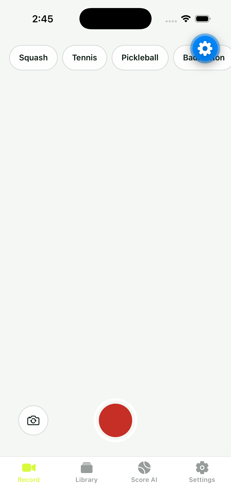
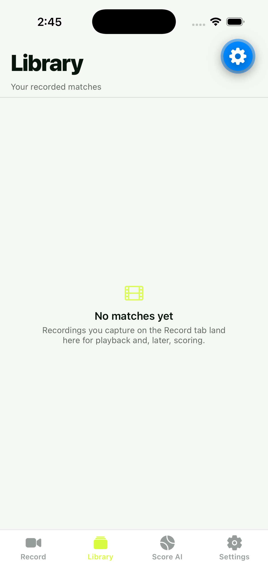
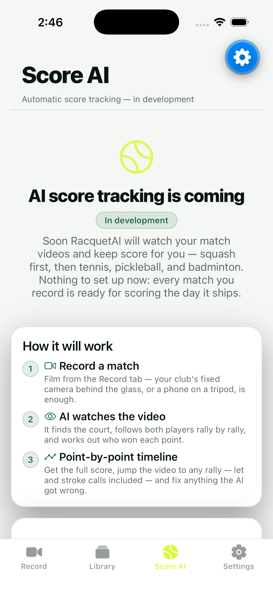
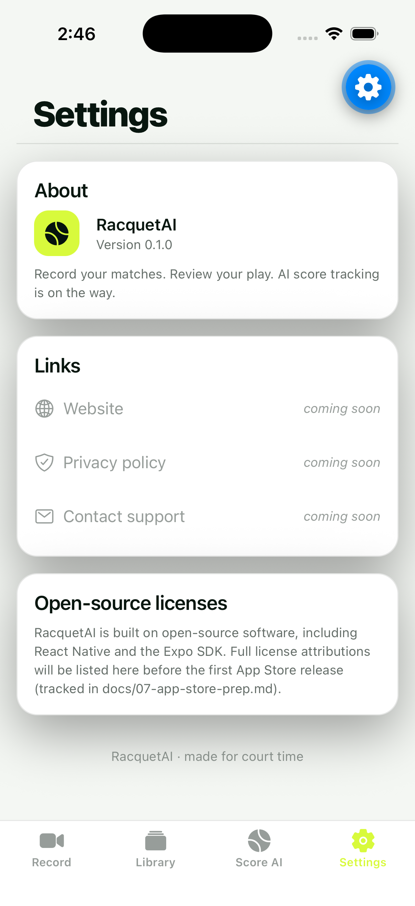
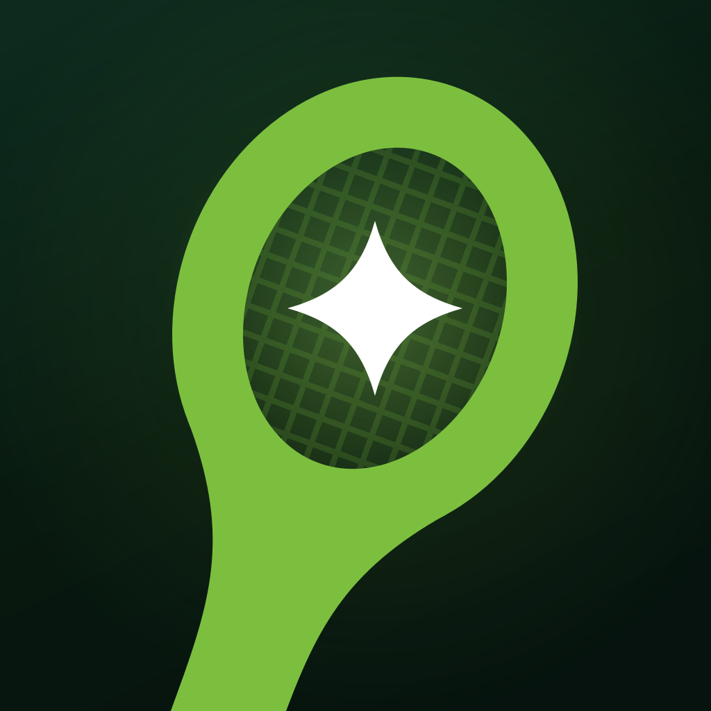
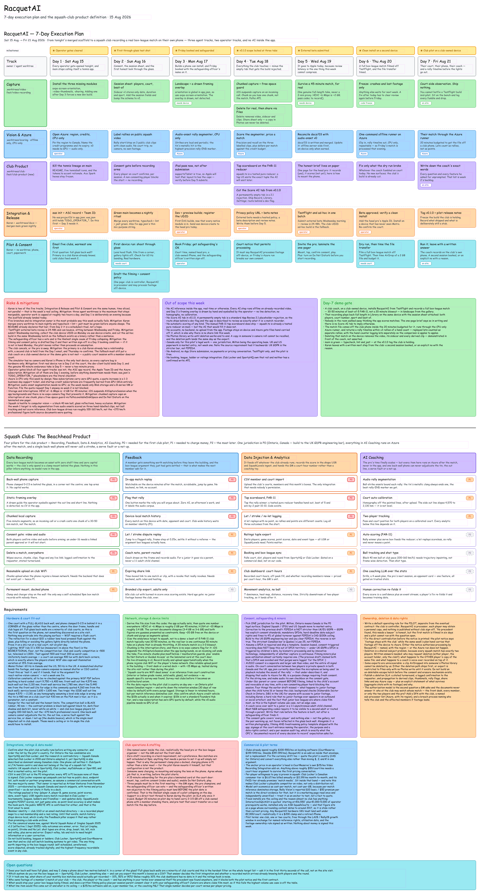

# RacquetAI — Build Day Report (Aug 15–16, 2026) · Made by Claude

> **Prepared by Claude** — this document, and everything it describes, was produced by Anthropic's Claude Code (models **Claude Fable 5** and **Claude Opus 5**) operating autonomously under the direction of Karan.
>
> **Repository:** <https://github.com/Karanvir1729/RacquetAI> · **Open pull request:** [#1 — squash-head teardrop brand mark](https://github.com/Karanvir1729/RacquetAI/pull/1)

---

## Executive summary

In one evening (6:54 PM – 10:33 PM EDT, Aug 15), Claude took RacquetAI from an empty directory to a **public GitHub repository containing a working, tested iOS app** — then verified it live in the iOS Simulator and produced this report the same night.

- **18 commits on `main`** (79 files, ~38,000 insertions), plus 4 feature branches and 1 open PR — all pushed to GitHub.
- **A working Expo/React Native iOS app** (v0.1.0): match video recording, a video library with playback, real squash (PAR-11) and tennis scoring engines behind an honest "in development" Score AI screen, and a settings screen — verified running in the iOS Simulator (screenshots below).
- **Quality gates green:** 178/178 Jest tests passing, TypeScript strict typecheck clean, lint clean, secrets audit clean (no credentials inherited from the predecessor app).
- **Complete brand identity** ("Ace Spark" / "Sweet Spot" icon) with an SVG-master → PNG asset pipeline, plus a competing squash-specific mark now open as [PR #1](https://github.com/Karanvir1729/RacquetAI/pull/1).
- **A full documentation set**: architecture, 5 ADRs, testing policy, App Store submission runbook, an AI-scoring build plan scoped to a US$10K Azure budget, and a 7-day execution plan delivered as an Excalidraw board.
- **Token spend:** ~**302.5 million tokens processed** / ~**2.49 million generated** across 4 Claude sessions and 36 subagents — an estimated **US$424–498 at Anthropic API list rates**. Full breakdown in the companion [token usage report](2026-08-15-token-usage-report-made-by-claude.md).

---

## The app, running (iOS Simulator, iPhone 17 — captured Aug 16)

| Record | Library | Score AI | Settings |
|---|---|---|---|
|  |  |  |  |

What the screenshots show: the sport selector (Squash first, then Tennis / Pickleball / Badminton), the record control with camera-flip, the library's empty state, the deliberately honest "AI score tracking is coming" screen with the three-step product explanation, and Settings displaying the brand icon at v0.1.0. The blue gear in the corner is the Expo Go development overlay, not part of the app.

---

## What shipped

### Features (with code locations)

- **Video recording** — [src/features/recording/](../src/features/recording/): `RecordScreen`, `RecordControls`, `PermissionGate` (graceful camera-permission handling), `SportChips`; built on `expo-camera` per ADR-003.
- **Video library + playback** — sidecar metadata storage (`storage.ts`, `metadata.ts`, `naming.ts`), `LibraryScreen`, `PlayerModal`, with unit tests.
- **Scoring engines** — [src/features/scoring/](../src/features/scoring/): a shared `ScoreEngine` interface with a **squash PAR-11 engine** (lets/strokes/no-lets as first-class events) and a tennis state machine, fully unit-tested. The UI ships an honest `ScoreComingSoon` screen instead of fake AI.
- **App shell** — 4-tab `expo-router` layout, shared component library, token-only dark/light theming via `DynamicColorIOS`, iPad layout support from day one (ADR-002 — the predecessor app was once rejected on iPad grounds).

### Brand

- "Ace Spark" identity: 5 SVG masters, a 9-colour palette with measured WCAG contrast ratios, and a `sharp`-based pipeline ([scripts/generate-assets.mjs](../scripts/generate-assets.mjs)) that regenerates and *verifies* every PNG (icon alpha rules, Android safe zones, silhouette purity).
- The **"Sweet Spot" app icon** on `main` won a three-way, parallel design competition judged at 1024/120/48 px.
- A competing **squash-accurate teardrop mark** (built in an isolated worktree) is open for review as [PR #1](https://github.com/Karanvir1729/RacquetAI/pull/1) — management can pick a direction.

### Documentation & planning

- [docs/01-architecture.md](../docs/01-architecture.md) — app structure and coding rules.
- [docs/02-daybot-infra-heritage.md](../docs/02-daybot-infra-heritage.md) — what was inherited from the operator's prior App-Store-shipped app (infrastructure only; no accounts, secrets, or brand).
- [docs/03-ai-scoring-plan.md](../docs/03-ai-scoring-plan.md) — the AI build contract: squash-first, US$10K Azure budget with per-phase allocations and kill criteria.
- [docs/06-decisions.md](../docs/06-decisions.md) — 5 ADRs, including ADR-005: a real Expo Go crash (worklets/reanimated native mismatch) diagnosed from the crash report and fixed the same evening.
- [docs/07-app-store-prep.md](../docs/07-app-store-prep.md) — submission runbook written from the predecessor's actual rejection experience.
- **Week-1 plan** ([docs/planning/](../docs/planning/)) — a 7-day execution board (Aug 15–21) ending with a real club recording a box-league match off TestFlight, delivered onto the user's live excalidraw.com board and reproducible from source:

---

## How the day unfolded

| Time (EDT) | What happened |
|---|---|
| 6:54 PM | Karan asked Claude for a new repo copying the proven iOS infrastructure of his shipped app (read-only reference), with video recording, honestly-stubbed AI scoring plus a real implementation plan, and full branding — built in parallel worktrees. |
| 7:00 PM | Repo created locally and on GitHub (private). Claude launched a 7-agent workflow: scaffold → 4 parallel feature worktrees → integrator → fresh-eyes auditor. |
| ~7:10 PM | Session forked. The fork resumed the build workflow after editing it to make **squash the primary sport**, then ran three more workflows to author, adversarially critique, and render the week-1 Excalidraw board. |
| 7:40 PM | All four feature branches merged to `main` with zero manual conflicts; audit committed fixes; everything pushed to GitHub. |
| 7:52–8:00 PM | First simulator run crashed Expo Go three times. Claude read the crash report, diagnosed a native-module version mismatch, realigned the dependency matrix (ADR-005), re-ran all tests, and hand-tested all four tabs in light and dark mode. |
| 8:28 PM | Week-1 board committed and injected into Karan's live excalidraw.com tab (after Claude caught and owned a mix-up: "I verified the wrong window."). |
| 9:38 PM | Karan: "squash first is right, make it public." Repo flipped public; a 3-designer icon competition launched. |
| 10:06–10:23 PM | A dedicated worktree session (Opus 5) redrew the brand mark with true squash teardrop geometry — now [PR #1](https://github.com/Karanvir1729/RacquetAI/pull/1). |
| 10:32 PM | Winning "Sweet Spot" icon integrated, verified, committed, pushed. Build day ends. |
| 2:38 AM (Aug 16) | This reporting session: pushed the last pending branch, opened PR #1, re-ran the app in the simulator for the screenshots above, mined all session transcripts, and produced these reports. |

## How it was built: multi-agent orchestration

This was not one chat thread. Claude coordinated **4 sessions and 36 subagents** across 5 multi-agent workflows:

- **Build workflow (7 agents):** one scaffolder, four parallel feature builders in isolated git worktrees (video, scoring, branding, infra-docs), one integrator, one fresh-eyes security auditor. Merged with zero manual conflicts.
- **Board workflows (multiple agents):** parallel authoring of the 7-day plan and squash-club product definition, a deterministic Python renderer with overlap self-checks, and a separate **adversarial critique pass** that cut real risks (dropped the Score AI tab from v0.1.0 as an App Review risk, moved the iPad pass before TestFlight, made Azure CPU-only for v0).
- **Icon competition (3 agents):** three designers iterated and self-critiqued renders at 1024/120/48 px; the winner was judged on home-screen legibility.
- **Report workflow (4 agents, this session):** mined 40+ MB of session transcripts to reconstruct this narrative with evidence.

## Verification (evidence, not claims)

- `npm test` — **178/178 tests passing** (re-run during report preparation, Aug 16).
- `npm run typecheck` — TypeScript strict, zero errors.
- Secrets audit — zero predecessor credentials or identifiers in the tree or git history (verified *before* the repo was made public).
- Live simulator pass — all four tabs exercised, light and dark mode, camera-permission edge case included; re-verified for this report (screenshots above).

## Open items for management

1. **Pick a brand direction** — "Sweet Spot" Optic-head icon (on `main`) vs. the squash-accurate teardrop mark ([PR #1](https://github.com/Karanvir1729/RacquetAI/pull/1)).
2. **Week-1 plan is live** — 5 tracks targeting a real club match recorded off TestFlight by Aug 21; Day-1 outreach to a known club.
3. **AI scoring** — engines and plan exist; model work is budget-gated (US$10K Azure, per-phase kill criteria) and intentionally not faked in the UI.

---

*Made by Claude (Claude Code) · Aug 16, 2026 · Sources: git history of [Karanvir1729/RacquetAI](https://github.com/Karanvir1729/RacquetAI), four Claude session transcripts and 36 subagent transcripts. Token accounting in the [companion report](2026-08-15-token-usage-report-made-by-claude.md).*
